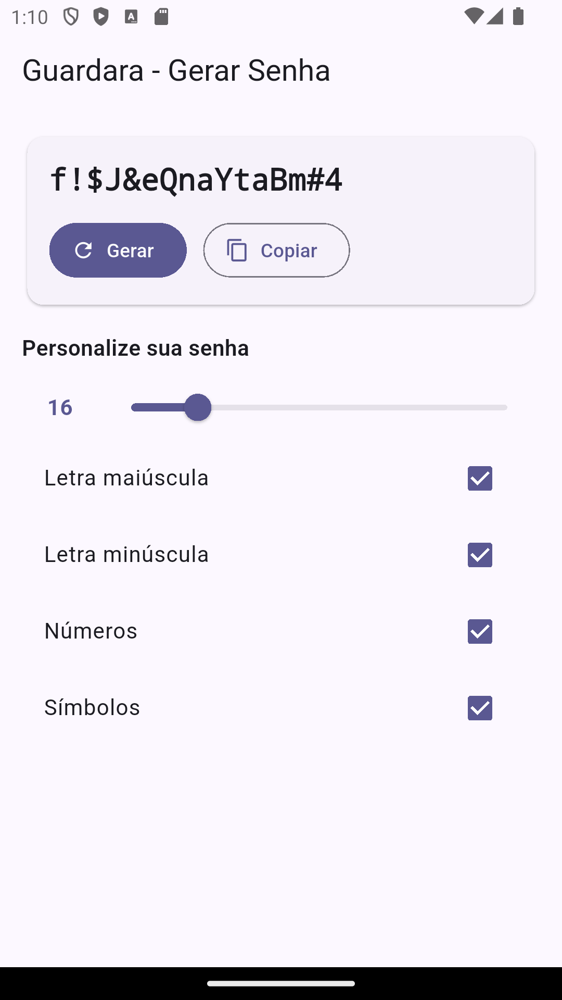

# Guardara 🔐

App Flutter para **gerar senhas fortes** e (futuro) **cripto utilitários** (hash, HMAC, KDF, cifragem).
Arquitetura **MVVM + Provider**. Foco em simplicidade, segurança e UX.



## Features
- Gerador de senhas com personalização (tamanho, maiúsc., minúsc., números, símbolos)
- MVVM com `ChangeNotifier` (Provider)
- Próximos: medidor de força (zxcvbn), hash/HMAC/KDF, cofre com Hive

## Stack
- Flutter (Material 3)
- Provider (estado)
- cryptography (hash/KDF/cifras)

## Rodando
```bash
flutter pub get
flutter run
