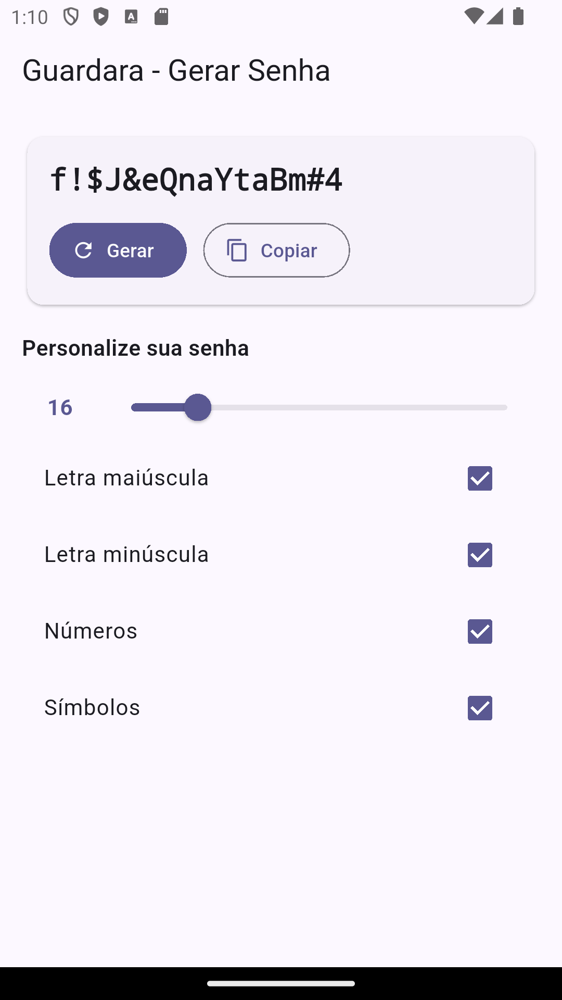

# **Guardara 🔐**

**Guardara** não é só mais um app de senhas — é o **seu cofre digital inteligente**.  

Começamos com um **gerador de senhas ultra-personalizável**, mas estamos evoluindo para um **arsenal completo de utilitários de segurança e criptografia**.  

Tudo com foco em **simplicidade, segurança e inovação**, porque ninguém merece complicação.


  
> *Imagem da versão inicial — base sólida para tudo que vem por aí!*

---

## **Funcionalidades Atuais**
- 🔑 **Gerador de senhas personalizável** (tamanho, maiúsculas, minúsculas, números, símbolos)  
- 🧠 Arquitetura limpa **MVVM + Provider**  
- 🎨 UI moderna com **Material 3**  
- ⚡ Código otimizado e pronto para evoluir com novas features  

---

## **Próximas Funcionalidades**
- 🛡 **Cofre seguro** com Hive para armazenar senhas e notas criptografadas  
- 🔐 **Login seguro** com biometria e autenticação em duas etapas (2FA)  
- 📊 **Medidor de força de senha** (zxcvbn)  
- 🌍 **Sincronização em nuvem** com Firebase para backup e multi-dispositivos  
- 🔔 **Alertas inteligentes** para senhas comprometidas  
- 📤 **Exportação/importação segura** de dados  

---

## **Funcionalidades Exclusivas da Versão Pro 💎**
- 🔒 **Camadas avançadas de criptografia exclusiva**  
  - Algoritmos híbridos customizados (AES-256 + RSA + KDF inovador)  
  - Padrões proprietários de ofuscação de dados para dificultar ataques  
- 💼 **Modo Empresarial**  
  - Gestão de senhas de equipe com permissões e auditorias  
- 🔐 **Cofres independentes** com múltiplos níveis de proteção  
- 🧠 **Análise de segurança inteligente**  
  - Recomendação de melhorias com base no padrão de uso  
- 🚀 **Performance otimizada** para grandes volumes de dados criptografados  
- 🌍 **Suporte premium** e acesso antecipado a novas ferramentas  

---

## **Stack Atual**
- **Frontend:** Flutter (Material 3)  
- **Gerenciamento de Estado:** Provider (ChangeNotifier)  
- **Criptografia:** cryptography e cryptography_flutter  
- **Armazenamento Local:** Hive (planejado)  
- **Armazenamento Seguro:** flutter_secure_storage  

---

## **Tecnologias Planejadas**
- **Cloud & Backend**
  - Firebase (Auth, Firestore, Cloud Functions, Storage)
  - Google Cloud KMS para gerenciamento de chaves
- **Integrações**
  - API de monitoramento de vazamentos de senhas
  - Notificações push com Firebase Messaging
- **Segurança**
  - Criptografia híbrida (AES + RSA)
  - Suporte a algoritmos KDF avançados (PBKDF2, Argon2)
  - Assinaturas digitais (HMAC, ECDSA)
- **Infraestrutura**
  - CI/CD com GitHub Actions
  - Testes automatizados (unitários, integração e widget)

---

## **Roadmap**
| Versão | Status | Destaques |
|--------|--------|-----------|
| **v1.0 – Base** | ✅ Concluída | Gerador de senhas, arquitetura **MVVM**, UI inicial |
| **v1.1 – UX Upgrade** | 🔄 Em desenvolvimento | Melhorias de **UI/UX**, temas claros/escuros e ajustes de usabilidade |
| **v1.2 – Preferências do Gerador** | ✅ Concluída | **Persistência no Hive** para salvar configurações do gerador |
| **v1.5 – Cofre Local** | 🔄 Em desenvolvimento | **Cofre de senhas local** com Hive, autenticação por PIN/biometria |
| **v2.0 – Cloud Sync** | 📅 Planejada | Backup na nuvem (Firebase) e sincronização multi-dispositivo |
| **v2.2 – Segurança Avançada** | 📅 Planejada | Criptografia AES + gerenciamento de chaves, alertas de vulnerabilidade |
| **v2.5 – Guardara Pro** | 📅 Planejada | Múltiplos cofres, permissões granulares, suporte a equipes |
| **v3.0 – Guardara Ecosystem** | 📅 Futuro | Integrações com APIs externas (ex.: 2FA, HaveIBeenPwned), automação e dashboards de segurança |

---

## **Rodando o Projeto**
```bash
flutter pub get
flutter run
